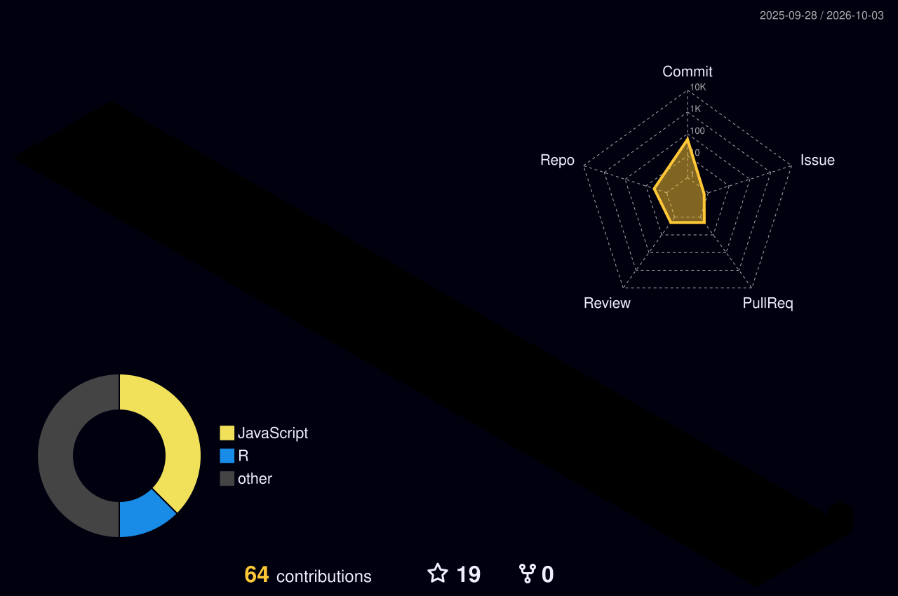

# Ergin C. Cankaya

**Ph.D. Candidate, University of Alberta** | **M.Sc., Virginia Tech**  
*Geospatial Data Scientist & Precision Forestry Researcher | GIS · Remote Sensing · LiDAR*

[![ORCID][orcid-shield]][orcid]
[![Google Scholar][gscholar-shield]][gscholar]
[![LinkedIn][linkedin-shield]][linkedin]
[![Website][website-shield]][website]

---

### Profile

Geospatial data scientist with 10+ years across the General Directorate of Forestry (Türkiye), the UNFCCC, the USDA Forest Service and the University of Alberta. I turn remote sensing and LiDAR data into forest measurements people can act on: inventory attributes, growth predictions, burn severity and carbon estimates, on pipelines that scale to terabytes.

* **GIS & Mapping:** ArcGIS Pro, ArcGIS Enterprise/Online, QGIS, MapLibre; cartography, geoprocessing, spatial analysis
* **Spatial Data:** enterprise geodatabase design, QA/QC and governance (PostgreSQL/PostGIS); FME and Python/R ETL
* **Remote Sensing:** LiDAR (terrestrial, mobile, UAV, airborne), Sentinel-2 and Landsat; land-cover classification, change detection, burn severity (Google Earth Engine)
* **Applied AI:** U-Net deep learning for land cover and individual-tree detection
* **Automation:** reproducible Python/R pipelines on 10 TB+ LiDAR archives

---

### Featured Work

#### [Istanbul RDF Land Cover Atlas](https://lulc-one.vercel.app/)
Five years of U-Net land cover over 2.2M hectares, published and then deployed as a live atlas.  
*Stack:* U-Net · Sentinel-2 · MapLibre · [ArtGRID 7(1): 26–44](https://doi.org/10.57165/artgrid.1709260)

#### [NFIT: National Forest Inventory Toolkit](https://nfit-two.vercel.app/en)
Turkey's National Forest Inventory for the Istanbul region: 851 field plots and 10,647 tree records (2019–2023), with plot maps and kriged hotspot surfaces. Replaces the original R Shiny app.  
*Stack:* Next.js · MapLibre · [Doctoral thesis](https://tez.yok.gov.tr/UlusalTezMerkezi/tezDetay.jsp?id=ne-iv9Dye14kgf5HizWRjA&no=nS33VmI8yfC1IRQeoNNxqg)

#### [FEMS: Forest & Ecosystem Management System](https://fems-amber.vercel.app)
Turkey's national forest management decision-support system, built for the General Directorate of Forestry under the GEF/UNDP integrated-forests programme.  
*Stack:* FVS simulation · forest planning · 3D stand visualisation

#### [Wildfire Demo in Turkey](https://potent-catwalk-418623.projects.earthengine.app/view/wildfire-demo-turkey)
Earth Engine app mapping burn scars and dNBR burn severity from Sentinel-2: İzmir 2019, Manavgat and Marmaris 2021, or any area you draw.  
*Stack:* Google Earth Engine · Sentinel-2 · dNBR

---

### Technical Stack

**GIS & Geospatial**  

**Remote Sensing & Point Clouds**  

**Languages & Analysis**  

**Machine & Deep Learning**  

**Web, Cloud & Tools**  

---

### 📈 Contributions

---

### Selected Publications

**Cankaya, E. C.**, & Burkhart, H. E. (2025).  
[*Evaluating local calibration methods for improving diameter growth predictions in the Southern Variant, Forest Vegetation Simulator (FVS-Sn).*](https://link.springer.com/article/10.1007/s44391-025-00044-6)  
**Journal of Forestry Research** (Springer).

**Cankaya, E. C.** et al. (2024).  
[*Advancing forest land monitoring integrating U-Net deep learning.*](https://doi.org/10.57165/artgrid.1709260)  
**ArtGRID – Journal of Architecture, Engineering and Fine Arts**, 7(1), 26–44.

**Cankaya, E. C.** et al. (2022).  
[*Using handheld mobile LiDAR technology in forest inventories.*](https://doi.org/10.17568/ogmoad.1016879)  
**Forestry Research Institute Journal (OGM)**.

**Cankaya, E. C.** et al. (2020).  
[*Single- and double-entry volume equations for Turkey oak (Quercus cerris L.) stands.*](https://forestist.org/en/single-and-double-entry-volume-equations-for-turkey-oak-quercus-cerris-l-stands-in-bursa-regional-directorate-of-forestry-132727)  
**Forestist**.

---

### Honors & Awards

| Year | Award |
|:---:|:------|
| **2025** | Best Speaker Award, Western Mensurationists Meeting |
| **2025** | Best Poster Award, Forest Industry Lecture Series (FILS) |
| **2023** | Graduate Recruitment Scholarship, University of Alberta |
| **2015** | Study Abroad Scholarship, Ministry of National Education, Türkiye |

---

**[Visit My Portfolio](https://ergin.ca/)** · **[Geo Portfolio](https://geo-portfolio-one.vercel.app/)**  
Open to GIS Analyst & Geospatial Data Scientist roles. For collaboration, reach out by email.

---

[orcid]: https://orcid.org/0000-0003-2553-8707  
[orcid-shield]: https://img.shields.io/badge/ORCID-0000--0003--2553--8707-A6CE39?style=flat-square&logo=orcid&logoColor=white  
[gscholar]: https://scholar.google.com/citations?user=0uLZ3mEAAAAJ  
[gscholar-shield]: https://img.shields.io/badge/Google_Scholar-4285F4?style=flat-square&logo=google-scholar&logoColor=white  
[linkedin]: https://linkedin.com/in/ergincagataycankaya  
[linkedin-shield]: https://img.shields.io/badge/LinkedIn-0077B5?style=flat-square&logo=linkedin&logoColor=white  
[website]: https://ergin.ca/  
[website-shield]: https://img.shields.io/badge/Portfolio_Website-100000?style=flat-square&logo=vercel&logoColor=white
